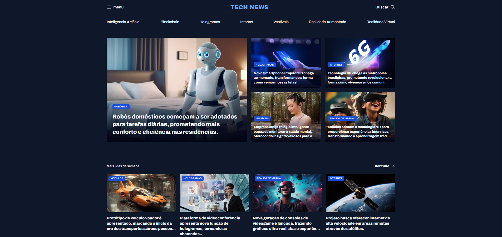

<h1 align="center"> TechNews - Portal de Notícias 🌐🤖 </h1>

<p align="center">
  Um portal de notícias moderno com foco em tecnologia, utilizando arquitetura CSS robusta e Layout Grid.
</p>

<p align="center">
  <a href="#-tecnologias">Tecnologias</a>&nbsp;&nbsp;&nbsp;|&nbsp;&nbsp;&nbsp;
  <a href="#-projeto">O Projeto</a>&nbsp;&nbsp;&nbsp;|&nbsp;&nbsp;&nbsp;
  <a href="#-arquitetura-css">Arquitetura CSS</a>&nbsp;&nbsp;&nbsp;|&nbsp;&nbsp;&nbsp;
  <a href="#-como-executar">Como Executar</a>
</p>

<br>

<p align="center">
  
</p>

## 🚀 Tecnologias

Este projeto foi construído focando em performance e organização de estilos:

- **HTML5** (Estrutura semântica avançada com `<article>`, `<figure>`, `<aside>`)
- **CSS3**
  - **CSS Grid Layout** (Uso de `grid-template-areas` para layouts complexos)
  - **CSS Variables** (Tema Dark Mode nativo)
  - **Utility Classes** (Criação de classes utilitárias reutilizáveis)
- **Google Fonts** (Fontes *Archivo* e *Poppins*)

## 💻 O Projeto

O **TechNews** é a interface principal de um portal de notícias de tecnologia. O objetivo foi criar um layout denso de informações, mas organizado visualmente, típico de grandes jornais digitais.

Funcionalidades de Design:
- **Tema Escuro (Dark Mode):** Paleta de cores moderna e confortável (`#0F172A`).
- **Layout Responsivo:** Adaptação fluida dos cards de notícias.
- **Hierarquia Visual:** Diferenciação clara entre notícia principal, secundárias e destaques laterais.

## 🎨 Arquitetura CSS (Destaque Técnico)

O grande diferencial deste projeto é a organização do CSS, que simula frameworks utilitários modernos. Em vez de escrever todo o estilo em um arquivo, o código foi separado por responsabilidade:

- `utility.css`: Contém classes atômicas como `.grid`, `.gap-16`, `.text-xl`. Isso permite montar o layout direto no HTML, agilizando o desenvolvimento.
- `sections.css`: Estilização específica das áreas (Featured, Weekly, AI).
- `global.css`: Definição de tokens de design (cores, tipografia) via Variáveis CSS (`:root`).

## 📂 Estrutura de Pastas

```bash
projeto-portal-de-noticias/
├── assets/
│   ├── icons/          # Ícones de UI (Menu, Busca, etc)
│   ├── images/         # Imagens das notícias
│   └── Logo.svg
├── styles/
│   ├── global.css      # Variáveis e Reset
│   ├── utility.css     # Classes utilitárias (Grid, Texto, Espaçamento)
│   ├── header.css      # Cabeçalho
│   ├── sections.css    # Áreas de conteúdo
│   └── index.css       # Hub de importação (@import)
├── index.html          # Markup principal
└── README.md           # Documentação
